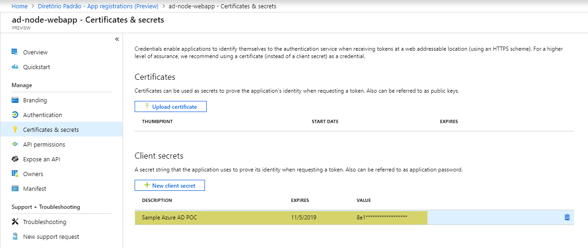

# Azure AD Login sample
==============================================================

## What is this?

This is a sample repository on how to SSO with Azure AD and get the ID Token for a given user... you'll need that ID Token to communicate with any API provided in the APP configuration registry. You can also use it as main source of user access control for any application.

This is the usual flow...

## Configuration

Copy `.sample.env` to `.env`

1. Register an Application on Azure AD page, with redirect URI as `http://localhost:3000`
https://portal.azure.com/#blade/Microsoft_AAD_IAM/ActiveDirectoryMenuBlade/RegisteredAppsPreview

2. Copy over the **Client ID** and **Directory (tenant) ID** to the `.env` file

3. Create a new Client Secret on https://portal.azure.com/#blade/Microsoft_AAD_RegisteredApps/ApplicationMenuBlade/Credentials
    

4. Update **Client Secret value** on `.env` file

5. Update the Application manifest to allow **Implicit Grant** and save the manifest.

6. Start the Server
`npm start`

7. Access http://localhost:3000

8. Click on Sign In (Redirect/Login flow) 

9. Check console for ID Token output

10. Click on Login (OIDC flow) 

11. Check console for connection SID

## TODO
- GraphQL Proxied sign in;
- Sign up example;
- Validate Sign out flow;

## References

Msal
https://github.com/AzureAD/microsoft-authentication-library-for-js

Msal usage example
https://github.com/Azure-Samples/active-directory-javascript-graphapi-v2

Azure AD (Passport.js) strategy
https://docs.microsoft.com/en-us/azure/active-directory/

Azure AD passport strategy usage example
https://github.com/Azure-Samples/active-directory-node-webapp-openidconnect